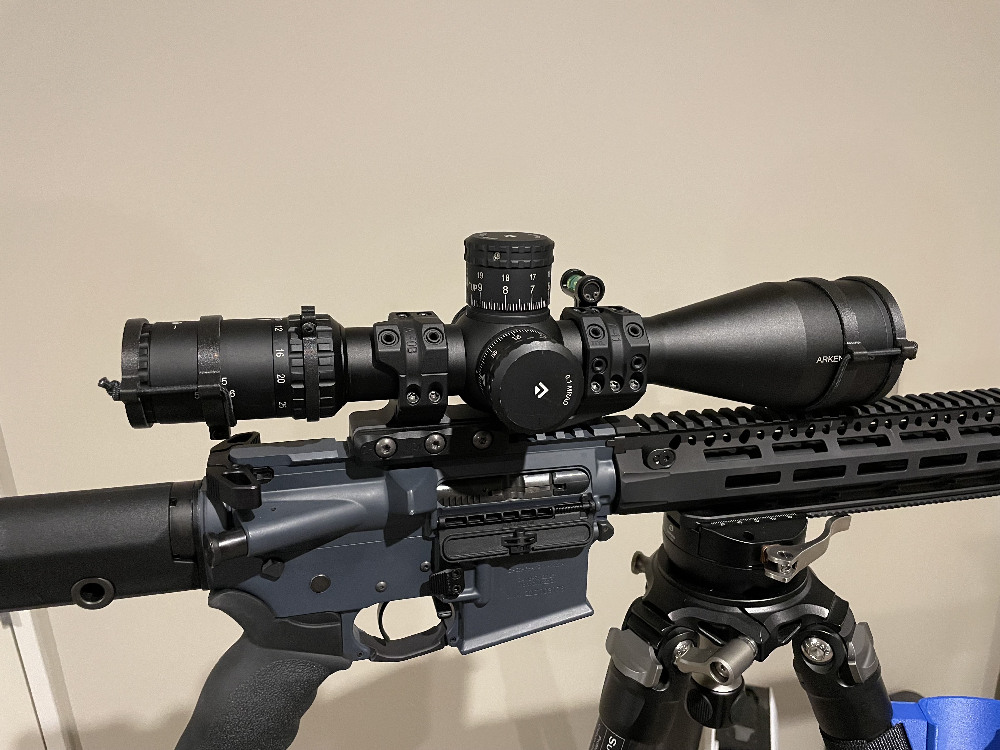

# PrintableScopeCover

Inspired by [ShockCollar™](https://onehundredconcepts.com/products/shockcollar) by One Hundred Concepts. This is the 3d printable version optimized for FDM printers. 

# Print Parameters

* Primary Material: ABS/PETG/PLA you name it.
* 4x walls
* 5x tops and bottoms layers.
* 0.4~0.45mm line width
* 40% infill.

# BOM

* 1x M3x10 SHCS
* 3mm Bungee/Shock Cord and cut to length

# Supported Rifle Scopes

* Arken EP5
